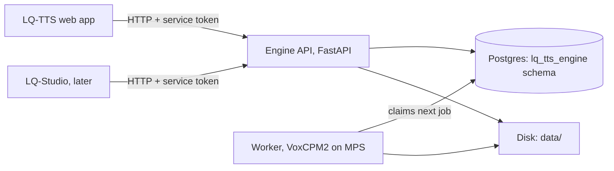

# LQ-TTS Voice Engine — Design

- **Date:** 2026-10-02
- **Status:** approved in chat by lqmnah (sections 1–5), pending review of this file
- **Sub-project:** 1 of 5 (engine → web app core → credits + Midtrans → public API → Studio editor)
- **Location:** mac-studio, `~/Developer/LQ-TTS/engine/`

## 1. Goal

An internal service that turns text into natural voiceover in a cloned voice using VoxCPM2,
for the public LQ-TTS app now and LQ-Studio later. Indonesian and English are first-class;
VoxCPM2's other 28 languages work without special handling.

### Measured basis (2026-10-02)

| Device | Real-time factor (lower = faster) |
|---|---|
| mac-studio M3 Ultra, MPS | 0.66 alone · 0.82 while DeepSeek-V4-Flash generates (LLM drops 26.7 → 25.3 tok/s) |
| lq-server i9-14900KF CPU | 7.6 |
| lq-server RTX 5070 | 0.42 (not used: busy with other projects) |

Peak MPS memory 11.8 GiB. Model: `openbmb/VoxCPM2` (Apache-2.0, weights already cached on mac-studio).

### Non-goals

- Real-time streaming playback (delivery is full file + per-sentence progress).
- Public exposure, end-user auth, per-user rate limits, billing, consent UI — those belong to sub-projects 2–4.
- Throttling the local LLMs that share the GPU.

## 2. Architecture

- **Approach:** single Python service with a Postgres-backed queue (chosen over Redis+Celery and over
  embedding the engine in the web app).
- **Processes (pm2):** `lq-tts-engine-api` (uvicorn, `127.0.0.1:8740`), `lq-tts-engine-worker`
  (exactly one; owns the model on MPS).
- **Stack:** Python 3.12 via `uv`, FastAPI, uvicorn, psycopg 3, `voxcpm`, `torch` (MPS),
  `faster-whisper` (CPU, int8, `small`), `av>=14,<16` (newer `av` breaks faster-whisper), ffmpeg
  (Homebrew; `atempo` + `loudnorm` available).
- **Database:** Postgres 5432 on mac-studio, database `lq_tts`, schema `lq_tts_engine`, own role.
  Credentials and service tokens in `engine/.env` (gitignored).
- **Data dir:** `~/Developer/LQ-TTS/data/` (gitignored).

### 2.1 Worker pipeline (per job)

1. **Split** text into paragraphs (blank line) and sentences (ending `.`, `?`, `!`).
   Abbreviations (`dr.`, `No.`, `Rp.`, `dll.`, `Mr.`, …) and decimals (`2.5`) do not end a sentence.
   A sentence under 3 words merges into the next sentence; a trailing one merges into the previous.
2. **Style:** markup `{{style: cheerful, slightly faster}}` before a sentence applies to that sentence only;
   it is passed to VoxCPM2 as its native `(…)` prefix. Plain parentheses in scripts are left alone.
3. **Generate** each sentence with prompt audio + prompt transcript + reference audio of the voice
   (`cfg_value=2.0`, `inference_timesteps=10`).
4. **Check:** Whisper transcribes the take on CPU; score = 1 − normalized character edit distance between
   script sentence and transcript after lowercasing, stripping punctuation and normalizing numbers
   (Indonesian and English number words ↔ digits, e.g. "satu" = "1", "dua puluh" = "20").
   Score < 0.85 ⇒ retake. Max 4 takes per sentence (1 + 3 retakes); keep the best-scoring take.
   Still < 0.85 ⇒ sentence `needs_review`; the job still completes.
5. **Trim** leading/trailing audio below −50 dB keeping 30 ms margin, 10 ms fade in/out.
6. **Tempo** per sentence with ffmpeg `atempo` (pitch preserved).
7. **Assemble** final audio: sentences joined by exact digital silence — sentence pause after sentences,
   paragraph pause after paragraph ends. Joins never fall inside speech (this replaces the post-hoc pause
   insertion that caused the 2026-10-02 glitches).
8. **Loudness:** two-pass ffmpeg `loudnorm` to −14 LUFS integrated, −1 dBTP.
9. **Export:** `final.wav` (48 kHz, 16-bit, mono), `final.mp3` (48 kHz, 192 kbps, mono),
   `subs.srt` and `subs.vtt` (one cue per sentence, from assembled timings).

### 2.2 Settings (per job, all optional)

| Setting | Default | Range |
|---|---|---|
| `speed` | 0.9 | 0.7–1.3 |
| `pause_sentence_s` | 0.45 | 0–3 |
| `pause_paragraph_s` | 0.80 | 0–3 |
| `loudness_lufs` | −14 | −24 to −9 |
| `formats` | `["mp3","wav","srt","vtt"]` | subset |

Pauses are measured in the final (post-tempo) audio.

### 2.3 Voice preparation

On upload, the worker (as a voice-prep task):
1. Converts to 48 kHz mono WAV.
2. Transcribes with Whisper (VAD on), detects language.
3. If the upload is longer than 20 s, picks the 10–20 s window of continuous speech (gaps ≤ 0.6 s) with the
   best average log-probability, cut at word boundaries with ≥ 0.25 s of pause.
4. Stores clip, its transcript (caller-supplied transcript wins if given and the upload is ≤ 20 s), clip start/end.
5. No continuous clean speech ≥ 8 s ⇒ voice `failed`, code `no_clean_speech`.

## 3. Data model (schema `lq_tts_engine`)

**voices**: `id` uuid pk · `owner_ref` text (caller's user id, opaque) · `caller` text · `name` text ·
`language` text (`id`/`en`/`auto`/detected code) · `status` (`processing`/`ready`/`failed`) · `error_code` ·
`source_path` · `ref_audio_path` · `ref_transcript` · `ref_seconds` · `clip_start_s` · `clip_end_s` ·
`created_at` · `deleted_at`.

**jobs**: `id` uuid pk · `voice_id` fk · `caller` (`lq-tts`/`lq-studio`) · `text` · `settings` jsonb ·
`status` (`queued`/`running`/`done`/`failed`/`canceled`) · `error_code` · `priority` int (regenerate > new job) ·
`revision` int (starts 1) · `attempts` int · `lease_until` timestamptz · `cancel_requested` bool ·
`chars` int · `audio_seconds` real · `callback_url` · `idempotency_key` · `created_at` · `started_at` · `finished_at`.
Unique `(caller, idempotency_key)`.

**sentences**: `job_id` fk · `idx` int · `paragraph_idx` int · `text` · `style` · `status`
(`pending`/`running`/`done`/`needs_review`) · `takes` int · `score` real · `asr_text` · `audio_path` ·
`duration_s` · `start_s` · `end_s` · `updated_at`. Primary key `(job_id, idx)`.

**Disk layout:** `data/voices/<voice>/{source.*,ref.wav}` ·
`data/jobs/<job>/takes/s<idx>_t<take>.wav` · `data/jobs/<job>/r<revision>/{final.mp3,final.wav,subs.srt,subs.vtt}`.

**Usage:** `chars` and `audio_seconds` per job feed LQ-TTS credits (sub-project 3).

## 4. API (`http://127.0.0.1:8740/v1`)

Auth: `Authorization: Bearer <token>`; one token per caller, token determines `caller`.
Callers only see voices and jobs they created.

| Endpoint | Result |
|---|---|
| `POST /voices` multipart: `audio`, `name`, `owner_ref`, `language?`, `transcript?` | `202 {id, status:"processing"}` |
| `GET /voices?owner_ref=` | list |
| `GET /voices/{id}` | detail incl. clip start/end, transcript, status |
| `GET /voices/{id}/preview.wav` | selected clip |
| `DELETE /voices/{id}` | soft delete + remove files; `204` |
| `POST /jobs` `{voice_id, text, settings?, callback_url?}`, header `Idempotency-Key?` | `202 {id, sentences_total, estimated_seconds}` |
| `GET /jobs/{id}` | status, progress, queue position, revision, file URLs, `needs_review` count |
| `GET /jobs/{id}/sentences` | per-sentence status, score, audio URL |
| `GET /jobs/{id}/events` (SSE) | `sentence_done`, `job_done`, `job_failed` |
| `POST /jobs/{id}/sentences/{idx}/regenerate` `{text?, style?}` | `202 {revision}`; `text` must be exactly one sentence, else `400 invalid_text` |
| `POST /jobs/{id}/cancel` | `202` |
| `DELETE /jobs/{id}` | cancels if running, removes all revisions and takes; `204` |
| `GET /jobs/{id}/files/{final.mp3\|final.wav\|subs.srt\|subs.vtt}?revision=` | file (default latest) |
| `GET /health` | `model_loaded`, device, queue depth, worker heartbeat age, rolling RTF |

- **Limits:** text ≤ 20,000 chars per job; upload ≤ 200 MB; formats MP3/WAV/M4A/FLAC.
- **Estimate:** `estimated_seconds` = chars ÷ 16 chars/s × rolling RTF of the last 20 sentences
  (default RTF 0.82) + queue ahead.
- **Idempotency:** same caller + same `Idempotency-Key` within 24 h returns the original job.
- **Callback:** `POST callback_url` with `{job_id, status, revision}`; headers `X-LQ-Timestamp` and
  `X-LQ-Signature: sha256=<hex HMAC of "<timestamp>.<body>" with the caller's callback secret>`.
- **Errors:** `{"error":{"code","message"}}` — `400 invalid_text`, `401 unauthorized`, `404 not_found`,
  `409 not_regeneratable`, `413 too_large`, `415 unsupported_audio`, `503 disk_full`, `503 model_loading`.

## 5. Errors and recovery

1. **Claiming:** `FOR UPDATE SKIP LOCKED`; lease 60 s renewed every 15 s. Expired lease ⇒ job requeued,
   `attempts += 1`, resumes at the first sentence not `done`. 3 attempts ⇒ `failed`, `worker_crashed`.
2. **MPS errors / OOM:** worker exits non-zero; pm2 restarts (exponential backoff); model reload ~70 s;
   `/health` shows `model_loaded:false` meanwhile.
3. **QA failure:** best take kept, sentence `needs_review`, job completes.
4. **Bad upload:** unreadable ⇒ `415`; no clean speech ⇒ voice `failed` / `no_clean_speech`.
5. **Cancel:** checked between sentences (stops within ~5 s).
6. **Callbacks:** 5 retries, backoff 1 s → 5 min, then logged and dropped; polling still works.
7. **Disk:** new jobs/voices refused with `503 disk_full` below 20 GB free; takes of non-latest revisions
   purged after 7 days; finals kept until the caller deletes the job's voice or the job.
8. **Shared GPU:** no LLM throttling; estimates use rolling RTF.
9. **Logs:** structured JSON per job/sentence (`pm2 logs lq-tts-engine-worker`).

## 6. Testing

Implementation is test-first (failing test, then code).

1. **Fast (no model, < 30 s, `pytest`):** splitter (fragments, paragraphs, abbreviations, decimals,
   style markup), number normalization ID/EN, score, pause assembly (exact gap lengths, fades),
   SRT/VTT timings, settings validation.
2. **Queue (real Postgres, test schema):** claim, lease expiry, resume from next sentence,
   3-attempt limit, cancel, regenerate priority.
3. **API (FastAPI TestClient + fake synthesizer that emits real tone audio):** every endpoint, every
   error code, idempotency, callback signature, SSE events.
4. **Regression (2026-10-02 bugs):** every join is exact silence with faded speech edges on both sides;
   "HP? Satu? Tiga?" never stacks pauses at one point; transcript "1, 3" scores ≥ 0.85 against "Satu? Tiga?".
5. **Slow (`-m slow`, real VoxCPM2 on MPS, Pandji voice, before every release):** 3 ID + 1 EN sentences
   each score ≥ 0.85; loudness −14 ± 1 LUFS; SRT cue count = sentence count.
6. **End-to-end on the pm2 service:** upload `VO-Sample-Pandji.mp3` ⇒ voice `ready` with clip shown;
   1-minute script ⇒ MP3/WAV/SRT/VTT; regenerate one sentence ⇒ revision 2; Whisper + join spectrogram check.

## 7. Open items (outside this sub-project)

- LQ-Studio containers (OrbStack) reaching `127.0.0.1:8740` via `host.internal` — verify when LQ-Studio integrates.
- Postgres role/database creation needs the existing superuser credentials on mac-studio (not in this repo).
- Git remote for `~/Developer/LQ-TTS` (none yet).
