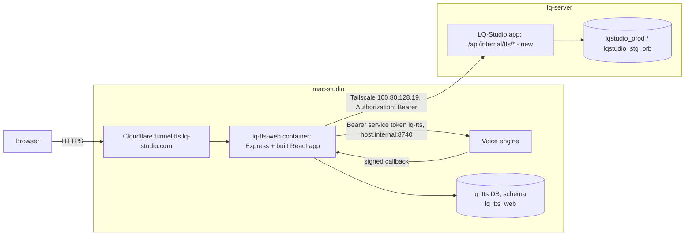

# LQ-TTS Web App — Design

- **Date:** 2026-10-02 (amended 2026-10-03 with measured LQ-Studio facts)
- **Status:** approved by lqmnah (sections 1–5 in chat, file "ok" 2026-10-03); amendment A below pending review
- **Sub-project:** 2 of 5 (engine → **web app core** → billing → public API → Studio editor). Billing (3) is largely absorbed by LQ-Studio's shared wallet decided here.
- **Location:** mac-studio, `~/Developer/LQ-TTS/web/` (same repo as the engine)
- **Depends on:** voice engine (`docs/superpowers/specs/2026-10-02-voice-engine-design.md`), running at `127.0.0.1:8740` on mac-studio

### Amendment A (2026-10-03) — measured facts that change details, not decisions

1. LQ-Studio PROD and staging run on **lq-server** (not mac-studio): PROD container `lq-studio-prod-app` (`127.0.0.1:3001`, image-baked, repo `/home/lq/lq-studio-prod/repo`), staging `lq-studio-stg-lqs` (`127.0.0.1:3012`). lqmnah chose: LQ-TTS web stays on **mac-studio** and calls LQ-Studio over Tailscale.
2. LQ-Studio already has an internal-route guard (`makeInternalSocialAuth`: `Authorization: Bearer`, rejects any request carrying Cloudflare headers, fails closed on short secrets, rate-limited). The TTS internal API reuses it under `/api/internal/tts/*` (no new header scheme).
3. Login identifier is email **or username**; LQ-Studio's API requires `emailVerified && phoneVerified` for any credit use, so `auth/verify` can answer `needs_verification`.
4. The credit kernel (`deductCredits`/`refundCredits`/`withJobRefundLock`) has no idempotency key; idempotency is enforced by LQ-Studio's `refId` convention.
5. Plans: `free` / `pro` / `ultra` / `sultan`; paid = `pro`, `ultra`, `sultan`; staff (admin/superadmin) are charged net-zero by the kernel. Top-up page: `/upgrade-plan`.
6. Verified: an OrbStack container on mac-studio reaches the engine at `http://host.internal:8740` (HTTP 200).

## 1. Goal

A public web app at `tts.lq-studio.com` where LQ-Studio users clone a voice from a recording and turn scripts into natural Indonesian/English voiceover, paying with their existing LQ-Studio credits.

### Decisions (lqmnah, 2026-10-02/03)

| Topic | Decision |
|---|---|
| Stack | Same as LQ-Studio: React Router 7 + Vite + Tailwind (client), Express (server), Docker on OrbStack |
| Host | mac-studio (web + engine together); LQ-Studio reached over Tailscale on lq-server |
| Domain | `tts.lq-studio.com` via Cloudflare tunnel from mac-studio; staging `tts-stg.lq-studio.com` behind Cloudflare Access |
| Accounts | LQ-Studio accounts only (no separate sign-up); login form on tts.lq-studio.com; credentials + 2FA verified **inside LQ-Studio** via a new internal endpoint |
| Wallet | One shared wallet: LQ-Studio credits; top-up uses LQ-Studio's existing Midtrans checkout |
| Money writes | Only LQ-Studio writes `credit_ledger`; LQ-TTS calls new internal hold/settle/refund endpoints |
| UI language | Indonesian ⇄ English toggle |
| Price | 10 credits per 1,000 characters (1 credit = Rp100), rounded up, minimum 1 credit per job |
| Voice cloning | Free; limit 3 voices on Free plan, 25 on any paid LQ-Studio plan (single config value) |
| Consent | Required checkbox per cloned voice, recorded with timestamp, IP and consent-text version |

### Non-goals

- Browser microphone recording (upload only), public marketing landing page, long-form Studio editor (sub-project 5), API keys (sub-project 4), a second payment gateway.
- LQ-TTS never writes to `lqstudio_*` databases and never copies password hashes or 2FA secrets.

## 2. Architecture

- **Ownership:** LQ-Studio owns users, plans and money. LQ-TTS web owns sessions, job history, charges and consent records. The engine owns voices and audio (`owner_ref` = LQ-Studio user id).
- **Session:** opaque session id in an httpOnly, Secure, SameSite=Lax cookie; server-side `sessions` row (revocable). The browser never sees engine or LQ-Studio tokens.
- **Containers (mac-studio, OrbStack):** `lq-tts-web-stg` (calls LQ-Studio staging) and `lq-tts-web-prod` (calls LQ-Studio PROD). Each serves the built client and `/api` from one Express process and reaches the engine at `http://host.internal:8740`.
- **Cross-host link:** LQ-Studio additionally publishes its app port on lq-server's Tailscale address only: PROD `100.80.128.19:3101 → 3001`, staging `100.80.128.19:3112 → 3002`. Never routed by any public tunnel; the internal guard rejects Cloudflare-forwarded requests and requires the per-environment Bearer secret (≥ 32 chars).

## 3. Screens (left sidebar after login)

| Menu | Contents |
|---|---|
| **Text to Speech** (home) | Script editor; voice picker; settings (speed 0.7–1.3 default 0.9, sentence/paragraph pause, format); live price "≈ N credits (RpX) · balance: B credits"; Generate. During a job: sentences turn done one by one (live events). After: play any sentence, edit text/style and regenerate just that sentence, switch revisions, download MP3/WAV/SRT/VTT. |
| **Voices** | My voices with status (processing / ready / failed + readable reason), preview, delete. "Clone a voice": upload MP3/WAV/M4A/FLAC ≤ 200 MB, name, language (auto/ID/EN), optional transcript, **required consent checkbox**. Shows "used X of N voices". |
| **History** | Past voiceovers: date, voice, status, characters, credits, duration; open / download / delete. |
| **Credits** | LQ-Studio balance, TTS usage list (from `charges`), **Top up** → `https://lq-studio.com/upgrade-plan` (staging: `https://demo.lq-studio.com/upgrade-plan`). |
| **Account** (top right) | Name/email, ID ⇄ EN toggle, log out. |
| **Login** | LQ-Studio email or username + password → 6-digit 2FA step only if enabled (TOTP or backup code) → "No account? Sign up on LQ-Studio" link. Unverified accounts see "Finish verifying your email and phone on LQ-Studio" with a link. |

## 4. Credits

| Event | Rule |
|---|---|
| Create job | credits = max(1, ceil(chars / 1000 × 10)); **hold** before queuing in the engine |
| Regenerate one sentence | same formula on that sentence's characters; separate hold |
| Job/regeneration done | **settle** the held amount (characters are known up front, so settle = hold) |
| Failed or canceled | **refund** the hold in full |
| Insufficient balance | `402` from hold → UI shows "Top up" prompt; nothing is queued |
| Voice limit | checked at upload: count of the user's voices in status processing/ready vs plan limit (Free 3, paid 25); existing voices are never removed on downgrade |
| Staff accounts | charged net-zero by LQ-Studio's kernel; LQ-TTS shows the nominal price |

Free accounts (100 credits) get ≈ 9 minutes of voiceover (≈ 11 credits per minute).

## 5. LQ-Studio internal TTS API (new, in the LQ-Studio repo, deployed on lq-server)

- Router file `server/http/routes/internal-tts.routes.js`, mounted next to the existing internal-social router; paths under `/api/internal/tts/*`; shares the `/api/internal` prefix intentionally (registered in `PEMILIK_GANDA_SENGAJA`).
- Every route uses the existing guard `makeInternalSocialAuth` with its own secret env `LQ_TTS_INTERNAL_TOKEN` (different per environment, ≥ 32 chars) and a TTS-sized rate limit (600 requests / 60 s).
- Implemented only with LQ-Studio's existing functions: `getUserByIdentifier`, `verifyPasswordAsync`, progressive-backoff `pbKey/pbCheck/pbFail/pbOk`, `totpStep`/`decryptSecret`/`consumeBackupCode`, `writeUser`, `bustAuthCache`, `effectiveTierId`, credit kernel `deductCredits`/`refundCredits`/`withJobRefundLock`, `queryLedgerByJobPrefix`. No duplicated auth or money logic.
- End-user IP is passed in the body (`ip`) and used for the login backoff keys, because every call arrives from the same peer.
- Ledger rows: `reason` `tts` (hold), `tts_settle`, `tts_refund`; `refId` = `tts:<engine job id>:r<revision>[:s<idx>]`, `refType` = `job`. LQ-Studio's Usage page gets labels for these reasons.

| Endpoint | Body | Result |
|---|---|---|
| `POST /api/internal/tts/auth/verify` | `{identifier, password, ip}` | `200 {status:"ok", user}` · `200 {status:"need_2fa", challenge}` · `200 {status:"needs_verification"}` · `401 invalid_credentials` · `403 suspended` · `429 rate_limited` (+ `retryAfter`) |
| `POST /api/internal/tts/auth/verify-2fa` | `{challenge, code, ip}` (TOTP or backup code; replay protection via `totpLastStep` and backup-code burn inside LQ-Studio) | `200 {status:"ok", user}` · `401 invalid_code` · `429 rate_limited` |
| `GET /api/internal/tts/users/:id` | — | `{id, name, email, plan, paid, balance, suspended, verified}` · `404` |
| `POST /api/internal/tts/credits/hold` | `{userId, amount, ref}` | `200 {holdId: ref, charged, balance}` · `402 insufficient_credits` |
| `POST /api/internal/tts/credits/settle` | `{userId, holdId, amount}` (amount ≤ held; remainder refunded) | `200 {balance}` |
| `POST /api/internal/tts/credits/refund` | `{userId, holdId}` | `200 {balance, refunded}` |

- `user` = `{id, name, email, plan, paid}` where `plan = effectiveTierId(user)` and `paid` = plan ∈ {pro, ultra, sultan} or staff.
- **Idempotency:** `holdId` is the `ref`. `hold` first reads ledger rows for that `refId`: if a `tts` deduct already exists it returns the original result without deducting again. `settle`/`refund` run under `withJobRefundLock(ref)` and pay only the net still owed (Σ deduct − Σ refund for that `refId`), so retries never move money twice.
- The 2FA `challenge` is LQ-Studio's own short-lived signed challenge (5 min) and carries a non-session claim so it can never be used as a login token.

## 6. LQ-TTS web data (database `lq_tts`, schema `lq_tts_web`, own role)

| Table | Columns (main) |
|---|---|
| `sessions` | `id` (random 256-bit, cookie value hashed at rest), `user_id`, `name`, `email`, `plan`, `paid`, `lang` (`id`/`en`), `created_at`, `expires_at` (30 days, sliding), `revoked_at` |
| `jobs` | `id` (engine job id), `user_id`, `voice_id`, `title` (first 60 chars), `chars`, `status`, `revision`, `created_at`, `finished_at`, `deleted_at` |
| `charges` | `id`, `user_id`, `job_id`, `revision`, `kind` (`job`/`regenerate`), `sentence_idx`, `chars`, `credits`, `hold_id`, `state` (`held`/`settled`/`refunded`), `created_at`, `resolved_at`, `attempts` |
| `voice_consents` | `voice_id`, `user_id`, `accepted_at`, `ip`, `consent_version` |

## 7. Browser API (`/api`, session cookie; CSRF: SameSite=Lax + `X-Requested-With` header on mutating calls)

| Group | Endpoints |
|---|---|
| Auth | `POST /auth/login` `{identifier, password}` → `{user}` · `{need2fa, challenge}` · `{needsVerification}` · `POST /auth/2fa` · `POST /auth/logout` · `GET /me` (user, plan, balance, lang, voice limit) · `PATCH /me` `{lang}` |
| Voices | `GET /voices` · `POST /voices` (multipart; `consent=true` required; plan limit) · `GET /voices/:id/preview` · `DELETE /voices/:id` |
| Voiceovers | `POST /jobs/estimate` `{text}` · `POST /jobs` `{voiceId, text, settings}` · `GET /jobs` · `GET /jobs/:id` · `GET /jobs/:id/sentences` · `GET /jobs/:id/events` (SSE relayed from the engine) · `POST /jobs/:id/sentences/:idx/regenerate` `{text?, style?}` · `POST /jobs/:id/cancel` · `DELETE /jobs/:id` · `GET /jobs/:id/files/:name?revision=` (streamed from the engine) |
| Credits | `GET /credits` (balance from LQ-Studio + usage from `charges`) |
| Engine callback | `POST /internal/engine-callback` — verifies `X-LQ-Signature` (HMAC, engine callback secret for caller `lq-tts`) → done ⇒ settle, failed/canceled ⇒ refund |

The end-user IP comes from `CF-Connecting-IP` (set by the Cloudflare tunnel) and is forwarded to LQ-Studio's login endpoints. All engine calls send `owner_ref` = session user id and check ownership (a user can only touch their own voices/jobs; the engine also scopes by caller).

## 8. Errors and recovery

1. **LQ-Studio internal API unavailable:** login shows "LQ-Studio is temporarily unavailable"; job creation is blocked (no hold possible); existing jobs still play and download.
2. **Hold ok, engine create failed:** refund immediately; show the engine's reason.
3. **Lost callback / failed settle or refund:** reconciliation loop every 60 s and at startup: charges `held` for > 2 min are checked against the engine job status → settle or refund; `attempts` counted; after 10 attempts the charge is flagged in logs for manual review (never auto-forgiven).
4. **Engine restarting** (`/v1/health` 503): banner "The voice engine is restarting, please wait"; jobs still queue.
5. **Voice failed:** readable message per engine error code (e.g. `no_clean_speech` → "The recording needs at least 8 seconds of clear speech").
6. **Session expired / plan changed / account suspended or unverified:** re-login or the matching message; plan and status are refreshed at login and on `GET /me` (cached ≤ 5 min).
7. **Upload limits:** enforced in the browser and on the server (size, type, consent, voice limit) before forwarding to the engine.

## 9. Testing and release

- **Server tests (Vitest + supertest):** against fake engine and fake LQ-Studio internal API HTTP servers; cover every money path (hold → engine fail → refund; callback → settle; reconciliation settle/refund; duplicate callback idempotency; 402), login + 2FA + needs_verification, session expiry/revoke, voice limit by plan, consent required, ownership checks, CSRF header.
- **LQ-Studio internal endpoints:** `node:test` in the LQ-Studio repo with its JSON-DB harness and the real credit kernel and 2FA helpers: idempotent hold, settle/refund exactly once, cross-user isolation, guard rejects Cloudflare headers and bad tokens; the repo's route-map/monolith guard tests stay green.
- **UI (SOP G5, Playwright on mac-studio):** login (incl. 2FA) → clone voice → generate → live progress → regenerate one sentence → download → ID⇄EN; screenshots at 390 px, 768 px, 1440 px; console clean; network clean.
- **Visual design (SOP G4):** `ui-pro-max`, `impeccable`, `design-taste-frontend`, `gpt-taste` together; `impeccable` in **Operate** mode; `reference/craft-floor.md` read right before UI edits; icons SVG only.
- **Release order:** (1) LQ-Studio internal API → LQ-Studio staging, then PROD via its deploy SOP on lq-server (snapshot + image tag first); (2) `lq-tts-web-stg` at `tts-stg.lq-studio.com` behind Cloudflare Access, calling LQ-Studio staging; (3) after Playwright passes on staging, `lq-tts-web-prod` at `tts.lq-studio.com`, calling LQ-Studio PROD.

## 10. Open items

- Voice engine branch `feat/voice-engine` must be integrated (merge) before this app ships.
- LQ-Studio secrets printed into an agent transcript on 2026-10-03 (JWT_SECRET, POSTGRES_PASSWORD, LQ_SOCIAL_TOKEN, SUPERADMIN_PASSWORD): rotation recommended; decision with lqmnah.

## Amendment B (2026-10-03, from planning)

1. **Web upload limit 95 MB** (Cloudflare caps request bodies at 100 MB on Free/Pro); client + server enforce it with code `too_large`; UI suggests MP3/M4A. The engine keeps 200 MB for internal callers. This overrides the 200 MB in §3.
2. **Cross-host link:** instead of publishing LQ-Studio ports on Tailscale (forbidden by LQ-Studio test `client-ip-ingress`, it would let tailnet hosts forge client IPs app-wide), a host relay on lq-server (`ops/host/jembatan-tts-internal.mjs`, systemd user units) serves `100.80.128.19:3101 → 127.0.0.1:3001` and `:3112 → 127.0.0.1:3012`, forwarding only `/api/internal/tts/*` and `GET /api/health`; everything else 404.
3. **C1 additions:** hold `409 ref_conflict`, `402` includes `balance`; settle `400 invalid_request`; settle/refund `404 not_found`, `503 ledger_unavailable`; verify-2fa `403 suspended` / `200 needs_verification`; guard errors carry `ok:false`. Settle is terminal (always writes a `tts_settle` row). Refs are opaque, `/^tts:[A-Za-z0-9:_-]{1,150}$/`; the create-job hold ref is `tts:<web uuid>:r1` (the uuid is also the engine Idempotency-Key).
4. **LQ-Studio login/2FA logic** is extracted into `services/akun/login-verify.js` and shared by `/api/auth/login[/2fa]` and the TTS door; challenges are bound to the door that issued them; anti-replay re-checked inside the user-write lock.
5. **C2 additions:** `internal_error` (500); missing CSRF header → `403 invalid_request`; cancel → `202 {status:"cancel_requested"}`; `/api/health` adds `signupUrl` (LQ-Studio `/signup`); relayed engine bodies send `Cache-Control: no-store`; `Me.voiceCount` may be `null` when the engine is unreachable.
6. **Engine callers:** staging web uses engine caller `lq-tts-stg`, prod uses `lq-tts`.
7. **Branch:** web work happens on `feat/web-app`, created in place from `feat/voice-engine` (the live engine runs from this checkout).

## Amendment C (2026-10-03, LQ-Studio commit dd9ed881)
1. **`tv` (tokenVersion).** The user object from `POST auth/verify`, `POST auth/verify-2fa` (`user`) and `GET users/:id` carries `tv`: a safe integer, LQ-Studio's `tokenVersion`, 0 when unset. LQ-Studio bumps it (it only ever rises) on a password change or "log out everywhere". The web stores the `tv` of the verify/verify-2fa answer per session (`sessions.user_tv`, migration 005; a missing or non-safe-integer `tv` counts as 0), not the later `users/:id` read, so a bump between the two still ends the login. Every successful `users/:id` refresh (≤ 5 min `/api/me` cache), whichever session triggers it, revokes that user's sessions with `user_tv` below the returned `tv`; if the refreshing session's own `user_tv` differs, the request answers `401 unauthorized`. Sessions opened after the bump keep working. While LQ-Studio is down the cached copy is still served.
2. **Suspended holds.** `POST credits/hold` for a suspended user → `403 {error:"suspended"}`, no money moves; settle and refund stay open. The web treats it as an unknown outcome (a replayed hold may have landed before the suspension): it refunds the ref at once (a 404 there leaves the charge for reconciliation), revokes every session of the user and answers `403 suspended`.
3. **Contract corrections** (the real door, found by the 2A final review):
   - An invalid `amount` (hold or settle) is rejected by zod before the service: `400 {error:<localized prose>, code:"validation", field:"amount"}`, not `invalid_request`.
   - A hold replay answers the CURRENT balance, not the balance at the first hold.
   - The guard's own rate limit answers `429 {ok:false, error:"rate_limited"}` with no `retryAfter` and no `Retry-After` header; the web then answers `429 rate_limited` with its default `Retry-After: 60`. Only the login backoff carries `retryAfter`.
