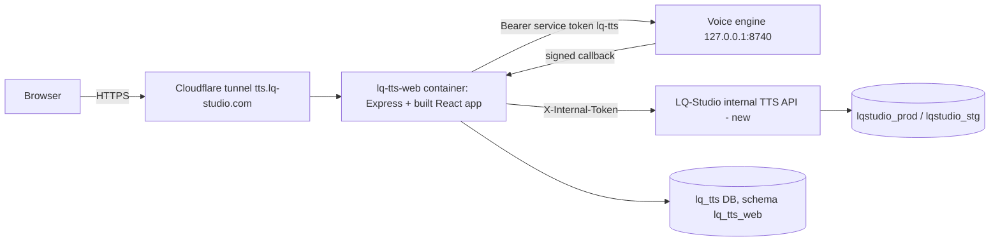

# LQ-TTS Web App — Design

- **Date:** 2026-10-02
- **Status:** approved in chat by lqmnah (sections 1–5), pending review of this file
- **Sub-project:** 2 of 5 (engine → **web app core** → billing → public API → Studio editor). Billing (3) is largely absorbed by LQ-Studio's shared wallet decided here.
- **Location:** mac-studio, `~/Developer/LQ-TTS/web/` (same repo as the engine)
- **Depends on:** voice engine (`docs/superpowers/specs/2026-10-02-voice-engine-design.md`), running at `127.0.0.1:8740`

## 1. Goal

A public web app at `tts.lq-studio.com` where LQ-Studio users clone a voice from a recording and turn scripts into natural Indonesian/English voiceover, paying with their existing LQ-Studio credits.

### Decisions (lqmnah, 2026-10-02)

| Topic | Decision |
|---|---|
| Stack | Same as LQ-Studio: React Router 7 + Vite + Tailwind (client), Express (server), Docker on OrbStack |
| Domain | `tts.lq-studio.com` via Cloudflare tunnel from mac-studio; staging `tts-stg.lq-studio.com` behind Cloudflare Access |
| Accounts | LQ-Studio accounts only (no separate sign-up); login form on tts.lq-studio.com; credentials + 2FA verified **inside LQ-Studio** via a new internal endpoint |
| Wallet | One shared wallet: LQ-Studio credits; top-up uses LQ-Studio's existing Midtrans checkout |
| Money writes | Only LQ-Studio writes `credit_ledger`; LQ-TTS calls new internal hold/settle/refund endpoints |
| UI language | Indonesian ⇄ English toggle |
| Price | 10 credits per 1,000 characters (1 credit = Rp100), rounded up, minimum 1 credit per job |
| Voice cloning | Free; limit 3 voices on Free plan, 25 on any paid LQ-Studio plan (single config value) |
| Consent | Required checkbox per cloned voice, recorded with timestamp, IP and consent-text version |

### Non-goals

- Browser microphone recording (upload only), public marketing landing page, long-form Studio editor (sub-project 5), API keys (sub-project 4), a second payment gateway.
- LQ-TTS never writes to `lqstudio_*` databases and never copies password hashes or 2FA secrets.

## 2. Architecture

- **Ownership:** LQ-Studio owns users, plans and money. LQ-TTS web owns sessions, job history, charges and consent records. The engine owns voices and audio (`owner_ref` = LQ-Studio user id).
- **Session:** opaque session id in an httpOnly, Secure, SameSite=Lax cookie; server-side `sessions` row (revocable). The browser never sees engine or LQ-Studio tokens.
- **Containers:** `lq-tts-web-stg` (talks to `lqstudio_stg` via LQ-Studio staging) and `lq-tts-web-prod` (talks to `lqstudio_prod` via LQ-Studio prod). Each serves the built client and the `/api` server from one Express process.
- **Open item (verify first in implementation):** the container must reach the engine bound to mac-studio loopback `127.0.0.1:8740` through OrbStack (`host.internal`). If it cannot, the Express server runs under pm2 on the host instead of in Docker; nothing else changes.

## 3. Screens (left sidebar after login)

| Menu | Contents |
|---|---|
| **Text to Speech** (home) | Script editor; voice picker; settings (speed 0.7–1.3 default 0.9, sentence/paragraph pause, format); live price "≈ N credits (RpX) · balance: B credits"; Generate. During a job: sentences turn done one by one (live events). After: play any sentence, edit text/style and regenerate just that sentence, switch revisions, download MP3/WAV/SRT/VTT. |
| **Voices** | My voices with status (processing / ready / failed + readable reason), preview, delete. "Clone a voice": upload MP3/WAV/M4A/FLAC ≤ 200 MB, name, language (auto/ID/EN), optional transcript, **required consent checkbox**. Shows "used X of N voices". |
| **History** | Past voiceovers: date, voice, status, characters, credits, duration; open / download / delete. |
| **Credits** | LQ-Studio balance, TTS usage list (from `charges`), **Top up** → LQ-Studio top-up page. |
| **Account** (top right) | Name/email, ID ⇄ EN toggle, log out. |
| **Login** | LQ-Studio email + password → 6-digit 2FA step only if enabled (TOTP or backup code) → "No account? Sign up on LQ-Studio" link. |

## 4. Credits

| Event | Rule |
|---|---|
| Create job | credits = max(1, ceil(chars / 1000 × 10)); **hold** before queuing in the engine |
| Regenerate one sentence | same formula on that sentence's characters; separate hold |
| Job/regeneration done | **settle** the held amount (characters are known up front, so settle = hold) |
| Failed or canceled | **refund** the hold in full |
| Insufficient balance | `402` from hold → UI shows "Top up" prompt; nothing is queued |
| Voice limit | checked at upload: count of the user's voices in status processing/ready vs plan limit (Free 3, paid 25); existing voices are never removed on downgrade |

Free accounts (100 credits) get ≈ 9 minutes of voiceover (≈ 11 credits per minute).

## 5. LQ-Studio internal TTS API (new, in the LQ-Studio repo)

- Mounted under `/internal/tts/*`, requires header `X-Internal-Token` (secret per environment), and is only reachable from mac-studio (loopback / OrbStack network; never routed by the public tunnel).
- Implemented with LQ-Studio's existing user, 2FA and ledger code (no duplicated logic). Ledger rows use source `lq-tts`, `ref` = `<job id>:r<revision>[:s<idx>]`.

| Endpoint | Body | Result |
|---|---|---|
| `POST /internal/tts/auth/verify` | `{email, password}` | `200 {status:"ok", user}` · `200 {status:"need_2fa", challenge}` · `401 invalid_credentials` · `429 rate_limited` |
| `POST /internal/tts/auth/verify-2fa` | `{challenge, code}` (TOTP or backup code; replay protection and backup-code consumption inside LQ-Studio) | `200 {status:"ok", user}` · `401 invalid_code` |
| `GET /internal/tts/users/:id` | — | `{id, name, email, plan, balance, active}` · `404` |
| `POST /internal/tts/credits/hold` | `{userId, amount, ref, idempotencyKey}` | `{holdId, balance}` · `402 insufficient_credits` |
| `POST /internal/tts/credits/settle` | `{holdId, amount}` (amount ≤ held; remainder returned) | `{balance}` |
| `POST /internal/tts/credits/refund` | `{holdId}` | `{balance}` |

`user` = `{id, name, email, plan}`; `plan` is LQ-Studio's plan code, mapped by LQ-TTS to "free" vs "paid" for limits. All hold/settle/refund calls are idempotent (same idempotencyKey or holdId → same result, never a second ledger row).

## 6. LQ-TTS web data (database `lq_tts`, schema `lq_tts_web`, own role)

| Table | Columns (main) |
|---|---|
| `sessions` | `id` (random 256-bit, cookie value hashed at rest), `user_id`, `name`, `email`, `plan`, `lang` (`id`/`en`), `created_at`, `expires_at` (30 days, sliding), `revoked_at` |
| `jobs` | `id` (engine job id), `user_id`, `voice_id`, `title` (first 60 chars), `chars`, `status`, `revision`, `created_at`, `finished_at`, `deleted_at` |
| `charges` | `id`, `user_id`, `job_id`, `revision`, `kind` (`job`/`regenerate`), `sentence_idx`, `chars`, `credits`, `hold_id`, `state` (`held`/`settled`/`refunded`), `created_at`, `resolved_at`, `attempts` |
| `voice_consents` | `voice_id`, `user_id`, `accepted_at`, `ip`, `consent_version` |

## 7. Browser API (`/api`, session cookie; CSRF: SameSite=Lax + `X-Requested-With` header on mutating calls)

| Group | Endpoints |
|---|---|
| Auth | `POST /auth/login` → `{user}` or `{need2fa, challenge}` · `POST /auth/2fa` · `POST /auth/logout` · `GET /me` (user, plan, balance, lang, voice limit) · `PATCH /me` `{lang}` |
| Voices | `GET /voices` · `POST /voices` (multipart; `consent=true` required; plan limit) · `GET /voices/:id/preview` · `DELETE /voices/:id` |
| Voiceovers | `POST /jobs/estimate` `{text}` · `POST /jobs` `{voiceId, text, settings}` · `GET /jobs` · `GET /jobs/:id` · `GET /jobs/:id/sentences` · `GET /jobs/:id/events` (SSE relayed from the engine) · `POST /jobs/:id/sentences/:idx/regenerate` `{text?, style?}` · `POST /jobs/:id/cancel` · `DELETE /jobs/:id` · `GET /jobs/:id/files/:name?revision=` (streamed from the engine) |
| Credits | `GET /credits` (balance from LQ-Studio + usage from `charges`) |
| Engine callback | `POST /internal/engine-callback` — verifies `X-LQ-Signature` (HMAC, engine callback secret for caller `lq-tts`) → done ⇒ settle, failed/canceled ⇒ refund |

All engine calls send `owner_ref` = session user id and check ownership (a user can only touch their own voices/jobs; the engine also scopes by caller).

## 8. Errors and recovery

1. **LQ-Studio internal API unavailable:** login shows "LQ-Studio is temporarily unavailable"; job creation is blocked (no hold possible); existing jobs still play and download.
2. **Hold ok, engine create failed:** refund immediately; show the engine's reason.
3. **Lost callback / failed settle or refund:** reconciliation loop every 60 s and at startup: charges `held` for > 2 min are checked against the engine job status → settle or refund; `attempts` counted; after 10 attempts the charge is flagged in logs for manual review (never auto-forgiven).
4. **Engine restarting** (`/v1/health` 503): banner "The voice engine is restarting, please wait"; jobs still queue.
5. **Voice failed:** readable message per engine error code (e.g. `no_clean_speech` → "The recording needs at least 8 seconds of clear speech").
6. **Session expired / plan changed:** re-login; plan is refreshed at login and on `GET /me` (cached ≤ 5 min).
7. **Upload limits:** enforced in the browser and on the server (size, type, consent, voice limit) before forwarding to the engine.

## 9. Testing and release

- **Server tests (Vitest + supertest):** against fake engine and fake LQ-Studio internal API HTTP servers; cover every money path (hold → engine fail → refund; callback → settle; reconciliation settle/refund; duplicate callback idempotency; 402), login + 2FA, session expiry/revoke, voice limit by plan, consent required, ownership checks, CSRF header.
- **LQ-Studio internal endpoints:** tests in the LQ-Studio repo against its real ledger and 2FA code on the staging database.
- **UI (SOP G5, Playwright on mac-studio):** login (incl. 2FA) → clone voice → generate → live progress → regenerate one sentence → download → ID⇄EN; screenshots at 390 px, 768 px, 1440 px; console clean; network clean.
- **Visual design (SOP G4):** `ui-pro-max`, `impeccable`, `design-taste-frontend`, `gpt-taste` together; `impeccable` in **Operate** mode; `reference/craft-floor.md` read right before UI edits; icons SVG only.
- **Release order:** (1) LQ-Studio internal API → LQ-Studio staging, then prod via its deploy SOP (DB snapshot first); (2) `lq-tts-web-stg` at `tts-stg.lq-studio.com` behind Cloudflare Access with `lqstudio_stg`; (3) after Playwright passes on staging, `lq-tts-web-prod` at `tts.lq-studio.com` with `lqstudio_prod`.

## 10. Open items

- Verify OrbStack container → host loopback `127.0.0.1:8740` (fallback: pm2 on host).
- Exact LQ-Studio plan codes to map to free vs paid (read from LQ-Studio code at implementation).
- LQ-Studio deploy location/SOP at implementation time (per brain L1 and LQ-Studio's own CLAUDE.md).
- Voice engine branch `feat/voice-engine` must be integrated (merge) before this app ships.
