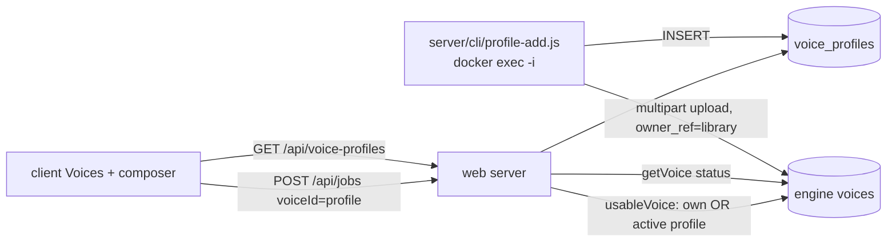

# VO Profile (library voices) — design

Date: 2026-10-03 · Status: approved by lqmnah (approach A, copy as written, Pandji public with permission) · Builds on: `2026-10-02-web-app-design.md` (amendments A–C).

## 1. Goal

LQ-TTS only has per-account cloned voices. Add **VO Profiles**: curated voices that every signed-in user can use without cloning. They come with a descriptive card (name, description, tags, best-for) and a recorded consent. The first profile is **Pandji**.

Success criteria:
- Any signed-in user on `tts.lq-studio.com` sees the Pandji card on the Voices page, can preview it, and can generate a voiceover with it at the normal price.
- Profiles never count toward the 3/25 voice limit and cannot be deleted by users.
- Turning a profile off (`active=false`) removes it everywhere at once: list, composer, new jobs. Existing jobs and their files remain.
- A consent record is stored for every profile.

Non-goals: user-submitted profiles, a profile marketplace, per-profile pricing, profile editing UI (an admin CLI is enough), English-native profiles.

## 2. Pandji profile (from the voice analysis of `data/fixtures/pandji/VO-Sample-Pandji.mp3`, 37 min, 2026-10-03)

Measurements: median F0 131.6 Hz (p10–p90 102–182 Hz); intonation range 10 semitones (p10–p90), std 4.4 st; spectral centroid ~1.0 kHz; ~130 words/min (Indonesian, faster-whisper `small`); pauses 25 % of the time, 15/min, median 0.62 s; loudness dynamics 24 dB (p10–p90); register: casual Jakarta Indonesian ("gue", "gitu").

| Field | Value |
|---|---|
| slug | `pandji` |
| name | `Pandji` |
| gender | `male` |
| language | `id` |
| description (id) | Pria, bariton hangat. Gaya bercerita yang santai dan tenang, intonasi ekspresif, penekanan tegas di kata kunci, jeda yang disengaja. Bahasa Indonesia kasual ala Jakarta. |
| description (en) | Male, warm baritone. Relaxed, calm storytelling with expressive intonation, firm emphasis on key words and deliberate pauses. Casual Jakarta-style Indonesian. |
| tags | Pria/Male · Bariton hangat/Warm baritone · Tegas/Firm · Tenang/Calm · Pencerita/Storyteller · Ekspresif/Expressive · Santai/Conversational · Bahasa Indonesia/Indonesian |
| best for (id) | Narasi, ulasan dan komentar film, podcast, video penjelasan, YouTube. |
| best for (en) | Narration, film reviews and commentary, podcasts, explainers, YouTube. |
| consent | subject `Pandji`; attested by `lqmnah` (owner states written permission is held); scope `Public library voice for all LQ-TTS users on tts.lq-studio.com`; granted_at = the date the CLI records it |

## 3. Architecture

- **Engine: unchanged.** A profile voice is an ordinary engine voice owned by the reserved `owner_ref = "library"`, created under the environment's caller (`lq-tts-stg` on staging, `lq-tts` on PROD). User owner refs are UUIDs, so they never collide with `library`. Each environment therefore has its own engine voice id for Pandji.
- **Web DB (migration `006_voice_profiles.sql`)**, table `voice_profiles`:
  - `voice_id uuid PRIMARY KEY` (the engine voice id)
  - `slug text UNIQUE NOT NULL` (`^[a-z0-9-]{1,40}$`)
  - `name text NOT NULL` (≤ 80)
  - `gender text NOT NULL CHECK (gender IN ('male','female','neutral'))`
  - `language text NOT NULL` (`id`|`en`)
  - `description_id text NOT NULL`, `description_en text NOT NULL`
  - `tags jsonb NOT NULL` (array of `{id,en}`, 1–12 items)
  - `best_for_id text NOT NULL`, `best_for_en text NOT NULL`
  - `consent_subject text NOT NULL`, `consent_attested_by text NOT NULL`, `consent_scope text NOT NULL`, `consent_granted_at timestamptz NOT NULL`
  - `active boolean NOT NULL DEFAULT true`, `sort integer NOT NULL DEFAULT 100`, `created_at timestamptz NOT NULL DEFAULT now()`
- **Server**
  - `services/profiles.js`:
    - `list()` returns active profiles ordered by `sort, name`;
    - `get(voiceId)` returns the active profile row or null.
  - `services/ownership.js`: `usableVoice(ctx, userId, voiceId)` gets the engine voice (404 on bad uuid or engine 404). It returns the voice when `owner_ref === userId`, or when `owner_ref === 'library'` AND `profiles.get(id)` is active. Otherwise it returns 404 `not_found`. `ownVoice` stays as it is, for delete.
  - `GET /api/voice-profiles` (auth required) returns `[{id, slug, name, gender, language, status, errorCode, description:{id,en}, tags:[{id,en}], bestFor:{id,en}, previewUrl}]`.
    - `status` comes from the engine (`processing|ready|failed`).
    - Profiles whose engine voice is missing (engine 404) are left out.
    - If the engine is unreachable, it returns the rows with `status: null`.
    - `previewUrl` = `/api/voices/<id>/preview`. Responses carry `Cache-Control: no-store`.
  - `POST /api/jobs` and `GET /api/voices/:id/preview` use `usableVoice`. `DELETE /api/voices/:id` keeps `ownVoice`, so a profile gives 404.
  - Voice limit and `GET /api/voices`: unchanged. They only cover the user's own voices.
  - The voice name is already denormalized into `jobs.voice_name`, so History and Credits show "Pandji" without changes.
- **CLI `server/cli/profile-add.js`** (ships in the image; reads env through `loadConfig`):
  - Run: `docker exec -i <container> node server/cli/profile-add.js --meta /dev/fd/3 --filename VO-Sample-Pandji.mp3 < audio 3< meta.json`. Any equivalent that sends the audio on stdin and the metadata as a JSON argument or file is acceptable; the plan fixes the exact form.
  - It validates the metadata, streams the audio to `engine.uploadVoice` with `owner_ref=library`, then polls `getVoice` every 5 s for up to 15 min until `ready`. On `failed` it exits 1.
  - It then inserts or updates the row by `slug`. A re-run replaces `voice_id` and deletes the old engine voice only after the new one is ready.
  - It prints only the ids and statuses.
  - `--deactivate <slug>` sets `active=false`.
- **Client**
  - `api.voiceProfiles()`.
  - **Voices page:** a "VO Profile" section above "Suara saya" with one card per profile, showing:
    - the name and tags as chips;
    - the description and "Cocok untuk / Good for" (in the UI language);
    - a preview button (shared one-at-a-time audio);
    - "Pakai suara ini / Use this voice", which goes to `/?voice=<id>`.

    There is no delete control. While processing, it shows a status chip. Failed profiles are hidden.
  - **Composer:** the voice picker groups "VO Profile" (ready profiles) and "Suara saya" (the user's ready voices). Default selection order: `?voice=` (if usable) → the draft's voice (if still usable) → the user's first ready voice → the first ready profile.
  - All new copy is ID/EN with no em dashes, in Operate mode with the existing tokens.

## 4. Error handling
- A deactivated profile used by a stale page: job create gets 404 `not_found`, which the composer shows as a voice error and reloads the profiles.
- Engine unreachable while listing: cards render without a status and the preview stays disabled. Job create surfaces the existing engine error mapping.
- CLI failures (engine failed, timeout, DB error) exit non-zero and leave no active row pointing at a non-ready voice.

## 5. Testing
- Server:
  - a profile is usable by two different users for preview and jobs;
  - delete returns 404;
  - the profile is not counted toward the limit;
  - an inactive profile returns 404 everywhere;
  - a library voice without a profile row returns 404;
  - list shape, filtering and ordering;
  - the CLI's validation, its re-run replacement order, and that it never prints secrets.
- Client: section rendering in both languages, the picker groups and the default order, `?voice=`, a stale profile 404.
- E2E: the local and staging journey generates one short voiceover with Pandji, and the screens include the Voices page with the profile card.
- Release: staging gate 5/5, then the same image to PROD, then `profile-add` on PROD, then `GET /api/voice-profiles` checked from inside the container (the PROD smoke can't log in).

## 6. Release order
1. Implement and run the local suites.
2. Build the staging image (`web/ops/build-image.sh`) and recreate the staging container.
3. Run `profile-add` on staging.
4. Run the staging Playwright gate.
5. Promote the same image to PROD.
6. Run `profile-add` on PROD.
7. Verify on PROD.
8. Commit, push `main` to GitHub, and write the brain note.
