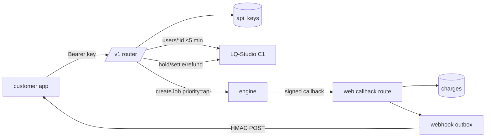

# LQ-TTS Public API (sub-project 4) — design

Date: 2026-10-04 · Status: approved by lqmnah (audience Pro+, async + webhook + polling, own voices + API-allowed profiles, keys in LQ-TTS at web price, per-account caps + web-first queue) · Builds on: `2026-10-02-voice-engine-design.md`, `2026-10-02-web-app-design.md` (amendments A–C), `2026-10-03-vo-profiles-design.md`, hardening `c17bbd7`.

## 1. Goal and success criteria
LQ-Studio paid users (plan pro, ultra, sultan; staff count as paid) can generate voiceovers from their own apps and automations, billed to the same shared LQ-Studio credits at the same price as the web app.

Success:
- A Pro+ user creates a key on `tts.lq-studio.com/api`. With curl they can list voices, create a job, receive a signed webhook or poll, and download MP3/WAV/SRT/VTT.
- Credits move exactly once per job (hold → settle/refund), as on the web.
- API traffic cannot starve web users: web jobs always run first, and per-account caps apply.
- A key stops working within 5 minutes after a password change ("log out everywhere"), a suspension or a downgrade below Pro, and immediately after revocation.

Non-goals (v1): cloning via API (voices are cloned in the web app with consent), regenerate/sentence editing via API, B2B organisations, per-tier quotas, API-specific pricing, SDKs.

## 2. Architecture
The API is a new router in the existing LQ-TTS web server (`web/server`), mounted at `/v1` before the cookie/CSRF middleware. It authenticates with `Authorization: Bearer lqtts_<keyId>_<secret>` only. It never reads cookies and sets no CORS headers (server-to-server).

### 2.1 Keys (`api_keys` table, web migration 007)
Columns:
- `id` (uuid), `user_id`, `name` (≤ 60)
- `key_id` (12 base32 chars, unique, public), `secret_hash` (sha256 hex of the secret)
- `webhook_secret_enc` (the per-key webhook signing secret, encrypted at rest with `API_ENC_KEY` / AES-256-GCM)
- `tv` (the user's tokenVersion when the key was created)
- `created_at`, `last_used_at`, `revoked_at`

Key format: `lqtts_<key_id>_<secret>`, where the secret is 32 random bytes in base32. Lookup is by `key_id`, then a constant-time compare of the hash. The secret and the webhook secret are shown once at creation.

Rules:
- Only Pro+ accounts may create keys; max 5 active keys per account.
- Every request runs the user check (the same ≤ 5-min cached `users/:id` refresh as the web app):
  - suspended or unverified → 403;
  - plan below Pro → 403 `plan_required`;
  - `tv` greater than the key's `tv` → the key is revoked, 401.
- Revoking a key is immediate.
- `last_used_at` is updated at most once a minute.

### 2.2 Endpoints (JSON; errors `{error:{code,message}}`)

| Method | Path | Purpose |
|---|---|---|
| GET | `/v1/voices` | The caller's ready voices plus active profiles with `apiAllowed`. Shape: `{id, name, language, kind:'own'|'profile', description?}` |
| POST | `/v1/estimate` | `{text}` → `{chars, credits, sentences}` (same formula as the web app) |
| POST | `/v1/tts` | `{text, voiceId, settings?, formats?, webhookUrl?}` → 202 `{jobId, credits, status:'queued'}`. Takes an `Idempotency-Key` header (≤ 100 chars, 24 h, per account). |
| GET | `/v1/tts/{jobId}` | `{jobId, status, progress:{done,total}, credits, errorCode, files:{mp3,wav,srt,vtt}?, createdAt}` |
| GET | `/v1/tts/{jobId}/files/{name}` | Streams a file (`final.mp3`, `final.wav`, `subtitles.srt`, `subtitles.vtt`) |
| DELETE | `/v1/tts/{jobId}` | Cancels if queued/running (refund rules as web cancel), otherwise deletes → 204 |

- Jobs created through the API are owned by the key's user and also appear in the web History, labelled "API".
- `voiceId` must be the user's own ready voice, or an active profile with `api_allowed=true`; otherwise 404.
- Text and settings are validated exactly as for `POST /api/jobs`.

### 2.3 Money
The API reuses the web app's charges service unchanged: hold before create, settle on done, refund on failure, cancel or deletion, plus reconcile. Charges and jobs get `source='api'` (new column, default `'web'`). A 402 `insufficient_credits` response carries `balance` and `topupUrl`.

### 2.4 Limits and fairness
- Per account:
  - ≤ 2 API jobs in `queued|running` at once, otherwise 429 `too_many_jobs`;
  - ≤ 60 requests/min across all of the account's keys, otherwise 429 `rate_limited` with `Retry-After`;
  - ≤ 20,000 chars per job (same as web).
- Engine (small engine change):
  - `POST /v1/jobs` accepts an optional `priority`, clamped to an allowed range per caller. The web caller sends `priority=5` for web jobs and `priority=1` for API jobs; regenerate keeps its priority 10.
  - `claim_job` already orders by priority, then FIFO, so web jobs are claimed first.
  - Starvation guard: an API job waiting longer than 10 min is treated as priority 5.

### 2.5 Webhooks
- `webhookUrl` is optional per job.
- Validation at create time:
  - `https` only, port 443 or none, length ≤ 500, no userinfo;
  - the host must resolve only to public IPs: loopback, RFC1918, link-local, CGNAT, ULA, multicast and metadata addresses are refused.
  - The address is resolved again at send time, the connection is pinned to the checked IP, and redirects are never followed.
- Events: `job.done` and `job.failed`. Body: `{event, jobId, status, credits, errorCode?, files?, createdAt}`.
- Signing:
  - headers `LQTTS-Signature: t=<unix>,v1=<hex HMAC-SHA256(secret, t + '.' + body)>` and `LQTTS-Event`;
  - the secret is the key's webhook secret.
- Delivery:
  - an outbox table (`webhook_deliveries`) with attempts at 0 s, 1 min, 5 min and 30 min, 10 s timeout each;
  - any 2xx counts as delivered; after the last attempt the delivery is marked `dropped`;
  - deliveries are visible on the API page (last 20 per key);
  - polling always works, whatever happened to the webhook.

### 2.6 Profiles
- Migration adds `voice_profiles.api_allowed boolean NOT NULL DEFAULT false`. The admin CLI gets `--api-allowed true|false`.
- Pandji stays `false` until lqmnah records API permission. His current consent covers tts.lq-studio.com only.

### 2.7 Client (LQ-TTS web app, Operate mode, existing tokens, ID/EN)
- The new "API" page (sidebar) is visible to everyone. Non-Pro accounts see an upgrade notice linking to LQ-Studio `/upgrade-plan`.
- Pro+ accounts see:
  - the key list (name, prefix `lqtts_<key_id>_…`, created, last used, revoke with an inline confirm);
  - "Create key": a name field, then a one-time panel showing the full key and the webhook secret with copy buttons;
  - a deliveries table;
  - a link to the docs.
- The docs page `/api/docs` (in-app route `/developers`, public, no login) covers auth, endpoints, the webhook signature check in Node/Python, errors, limits and curl examples.
- History shows an "API" chip for `source='api'` jobs.

## 3. Security
- Keys are hashed. The webhook secret is encrypted with `API_ENC_KEY`, a separate 32-byte key in each container's env file, so no JWT-style coupling.
- `/v1` refuses cookies (it ignores the `lqtts_sid` cookie entirely) and cannot reach any cookie-authenticated route.
- The body limit is the same as the existing `/api/jobs`. The SSRF guard described above applies.
- Audit log lines are written for key create, revoke and auto-revoke (tv/plan). Secrets never appear in logs.

## 4. Testing
- Server:
  - key lifecycle: create (Pro gate), hash only, the max-5 limit, revoke, auto-revoke on tv/suspend/downgrade;
  - every endpoint, plus ownership (another user's job or voice → 404);
  - `api_allowed` filtering;
  - idempotency;
  - the caps (2 jobs, 60/min);
  - the money path through the existing fakes (exactly-once);
  - webhooks: the SSRF matrix, signature, retries, dropped;
  - the engine priority field and its clamping per caller.
- Engine: priority ordering and the starvation guard.
- Client: the API page states (non-Pro, empty, list, one-time panel, revoke) and the History chip.
- E2E: the local harness creates a key through the UI, runs the curl-equivalent flow with Node fetch (create → webhook to a local receiver, which is allowed only in the local target via config `WEBHOOK_ALLOW_LOOPBACK=true`, never in staging or PROD → download), and screenshots. The staging gate runs the same flow with polling, since webhooks to the internet need a public receiver.

## 5. Release
Release order: engine first (backward-compatible priority field), then the web image on staging, a staging gate plus an API smoke with a real staging key, then the same image to PROD, then a PROD smoke (no paid API job without lqmnah's account). Then the brain note and the GitHub push.
